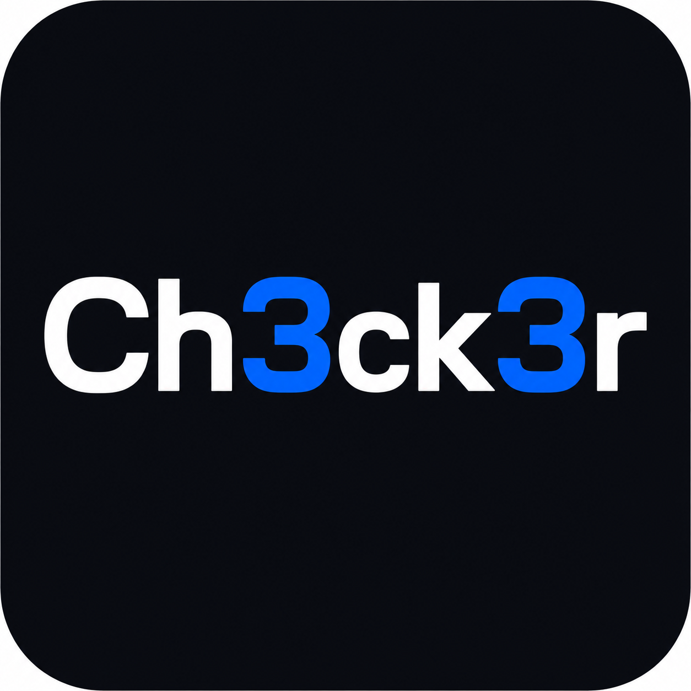

<div align="center">
  

# Ch3ck3r

**Open-source API security tooling with a local-first SAST extension for Visual Studio Code.**

[](vscode-extension/README.md)
[](https://github.com/msabenda/ch3ck3r/actions/workflows/vscode-extension.yml)
[](LICENSE)
[](https://owasp.org/API-Security/)

</div>

> [!IMPORTANT]
> Ch3ck3r is a defensive review aid. Its heuristic findings can include false positives and false negatives; they are not proof that an application is secure or vulnerable.

## Repository Components

| Component | Purpose | Status |
| --- | --- | --- |
| [`vscode-extension/`](vscode-extension/) | Local SAST, inline diagnostics, OpenAPI checks, reports, and optional backend integration | Primary, installable locally |
| [`backend/`](backend/) | FastAPI orchestration API for optional external scanners and scan records | Development |
| [`frontend/`](frontend/) | Next.js dashboard for projects, scans, findings, and reports | Development |
| [`docker/`](docker/) and [`kubernetes/`](kubernetes/) | Self-hosting and deployment examples | Experimental |

The VS Code extension works independently. You do **not** need the backend, database, Docker, Semgrep, ZAP, or Nuclei for its built-in local rules.

## VS Code Extension

Ch3ck3r SAST scans supported source and configuration files locally and presents findings in VS Code’s Problems panel and Ch3ck3r activity view.

### Highlights

- OWASP API Security Top 10-oriented rules
- JavaScript, TypeScript, Python, Go, and Java checks
- Experimental Ruby, Rust, Dockerfile, Terraform, and Kubernetes checks
- YAML/JSON OpenAPI and Swagger analysis
- Inline diagnostics, hovers, reviewed quick fixes, and a findings explorer
- SARIF 2.1.0, JSON, Markdown, and HTML reports
- Stable finding fingerprints and secret-value redaction
- Workspace Trust enforcement and bounded file scanning
- Local scanning without telemetry or source-code upload

See the [capability matrix and limitations](vscode-extension/README.md#capability-matrix) before relying on results.

## Install Locally

### Prerequisites

- Node.js 22 LTS
- npm 10+
- Visual Studio Code 1.82+

### Build and install a VSIX

```bash
git clone https://github.com/msabenda/ch3ck3r.git
cd ch3ck3r/vscode-extension
npm ci --ignore-scripts
npm test
npm run security:gates
npm run package:vsix
code --install-extension ch3ck3r-sast-1.2.0.vsix
```

Reload VS Code, open the Command Palette, and run:

```text
Ch3ck3r: Scan Current File
```

To uninstall:

```bash
code --uninstall-extension remnant01.ch3ck3r-sast
```

### Run from source while developing

1. Open `vscode-extension/` in VS Code.
2. Select **Run and Debug**.
3. Launch an **Extension Development Host**.
4. Open a test project in the new window.
5. Run `Ch3ck3r: Scan Current File` or `Ch3ck3r: Scan Workspace Folder`.

## Extension Verification

```bash
cd vscode-extension
npm ci --ignore-scripts
npm run check
npm run test:coverage
npm audit --audit-level=high
npm run security:gates
npm run package:vsix
npm run security:gates
npm run package:check
```

The current security suite exercises activation in untrusted workspaces, URL restrictions, cancellation and size limits, report escaping, secret redaction, filesystem containment, symlink rejection, OpenAPI dispatch, and stable fingerprints.

## Optional Platform

The backend and dashboard extend Ch3ck3r with scan orchestration and centralized findings. They are not required for local SAST and should be treated as development software.

```bash
cp backend/.env.example backend/.env
# Review and replace every development credential before starting services.
docker compose up --build
```

Only scan systems you own or have explicit permission to test. Active scanners can alter state, create traffic, or trigger defensive controls.

## Security and Privacy

- Built-in extension rules execute locally.
- Telemetry is not collected by default.
- Backend actions require an explicit command and a trusted workspace.
- Remote backend URLs require HTTPS; loopback HTTP is permitted for development.
- Backend tokens are stored with VS Code SecretStorage.
- Findings and reports redact matched secret values.

Read [`SECURITY.md`](SECURITY.md) and [`vscode-extension/THREAT_MODEL.md`](vscode-extension/THREAT_MODEL.md) for disclosure and trust-boundary details.

## Contributing

Contributions to detection quality, tests, documentation, accessibility, SARIF output, and secure defaults are welcome. Start with [`CONTRIBUTING.md`](CONTRIBUTING.md).

## Roadmap

- Improve AST-aware rules and reduce noisy pattern matches
- Add measured precision/recall fixtures for supported ecosystems
- Expand OpenAPI semantic validation
- Publish reproducible, signed Marketplace releases
- Add documented SARIF integration examples for GitHub code scanning

## License

Ch3ck3r is available under the [MIT License](LICENSE). Copyright © 2026 Msambili Ndaga.
